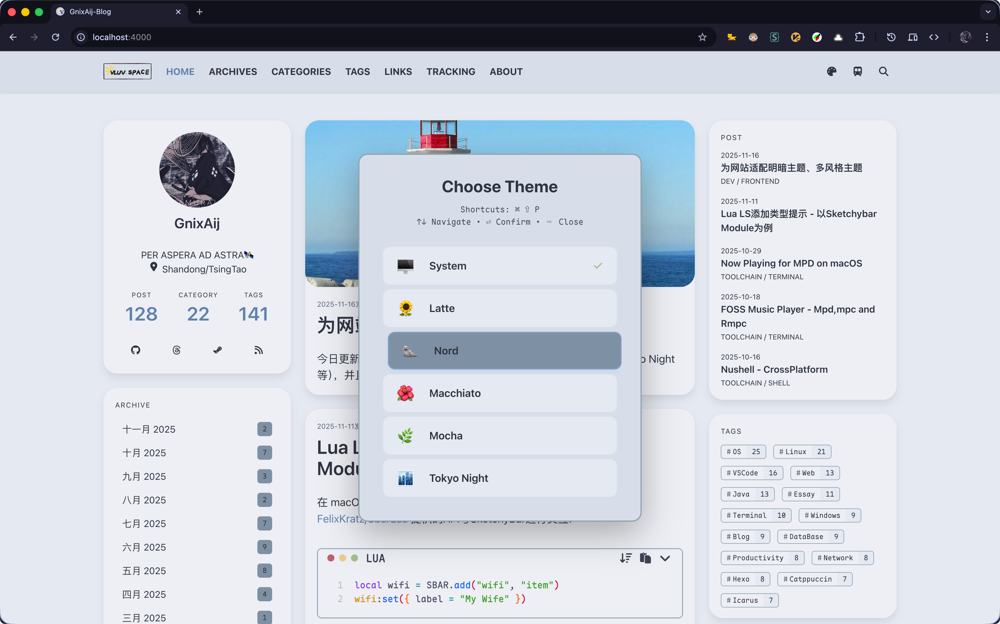
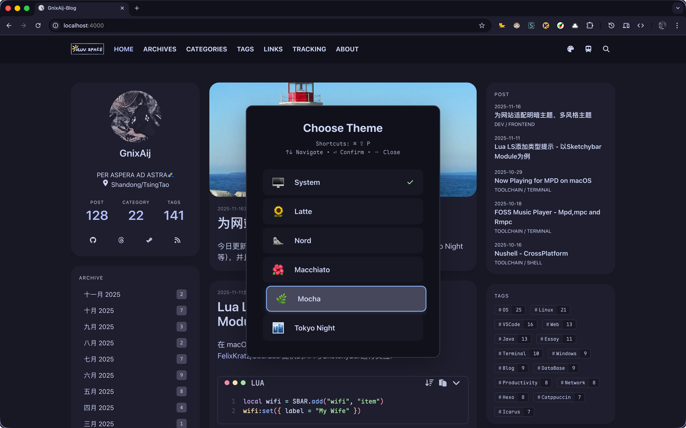
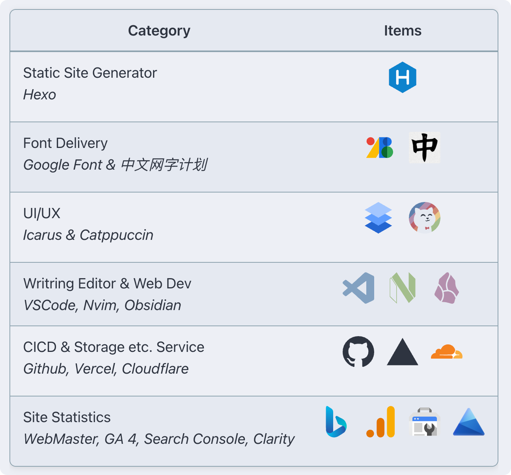
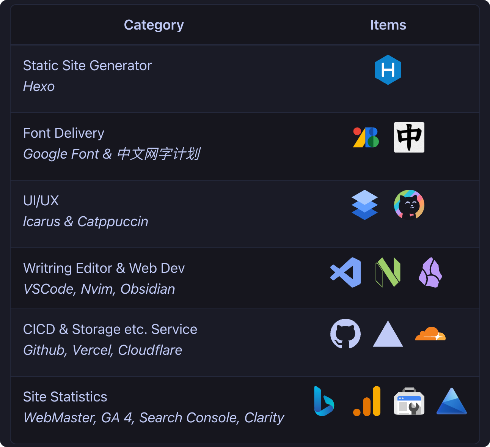
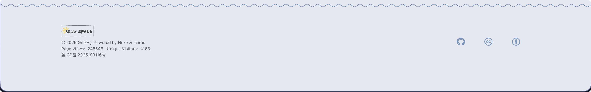
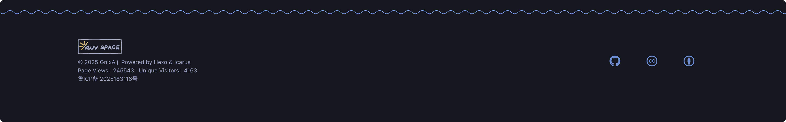

# Hexo Theme Icarus

## Demo & Preview

[vluv's space](https://vluv.space/)

### Multiple Theme Support

Support multiple light and dark themes:

- **System Theme**: Follow system theme automatically, use `Nord` for light mode and `Mocha` for dark mode by default
- **Light Themes**: `Nord`, `Cattpuccin Latte`
- **Dark Themes**: `Catppuccin Mocha`, `Catppuccin Macchiato`, `Tokyo Night`

|  |  |
| --------------------------- | ---------------------------- |

### Components

#### Table

|  |  |
| ---------------------------------------------- | ----------------------------------------------- |

#### Quote

|  |
| ----------------------------------------------- |
|   |

#### Footer

|  |
| ----------------------------------------------- |
|  |

## Installation

```shell
$ bun add hexo-theme-gnix
$ hexo config theme gnix
```

## Setup

<details>
<summary>Math Rendering Setup</summary>

To enable math rendering with optimized performance, use [markdown-it-mathjax3-pro](https://github.com/NeoNexusX/markdown-it-mathjax3-pro), which supports both SSR and CSR modes

</details>

<details>
<summary>Code Highlight Setup</summary>

Use [hexo-shiki-highlight](https://github.com/Efterklang/hexo-shiki-highlight) plugin for code block highlighting, support multiple themes as well;

Set `syntax_highlighter` to `shiki` in your hexo `_config.yml`:

```yaml _config.yml
# Syntax Highlighter
syntax_highlighter: shiki
```

|  |  |
| ----------------------------------------------------------------------------------------------------------------------------------- | ----------------------------------------------------------------------------------------------------------------------------------- |

</details>
